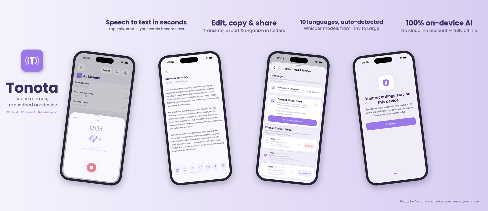

# Tonota

**Privacy-first voice memos for iPhone — transcribed and polished entirely on your device.**

Zero cloud. Zero account. Your voice never leaves your phone.

 

 

---

## Why Tonota?

Most voice memo apps upload your audio to a server for transcription. Tonota doesn't. Everything — recording, speech-to-text, and AI text polishing — runs locally on your iPhone using Apple Silicon.

- 🔒 **No cloud, no account, no tracking** — audio and transcripts stay in local storage, period
- ✈️ **Works fully offline** — transcribe on a plane, in the U-Bahn, anywhere
- 🧠 **On-device AI** — WhisperKit for transcription, local LLM for cleaning up your rambling into readable notes

## Features

- **On-device transcription** — powered by [WhisperKit](https://github.com/argmaxinc/WhisperKit), up to Whisper Large v3, 10 languages
- **AI text polishing** — a local LLM (via [MLX](https://github.com/ml-explore/mlx-swift)) turns raw speech into clean, readable text; pick your model with quality ratings
- **Live dictation mode** — optional real-time transcription while you speak
- **Folders & search** — organize memos, search across titles and transcripts
- **Batch export** — transcripts as `.txt`, original audio included
- **Localized** — English, Deutsch, 简体中文

## How it's built

Swift / SwiftUI · SwiftData (local-only, no CloudKit) · WhisperKit · mlx-swift-lm

> The story: from first line of code to App Store approval in **9 days** — written up [on LinkedIn](https://www.linkedin.com/feed/update/urn:li:activity:7470456182693056512/).

## Roadmap

- Siri & Shortcuts support ("start recording" App Intent)
- Streaming LLM output
- Import / export improvements
- Optional noise reduction

Found a bug or have a feature request? [Open an issue](../../issues) — feedback is very welcome.

## Privacy

Tonota collects nothing. See the [privacy policy](https://janewu77.github.io/Tonota/privacy.html).

---

Built in Hamburg 🇩🇪 by [Jane Wu](https://github.com/janewu77)

