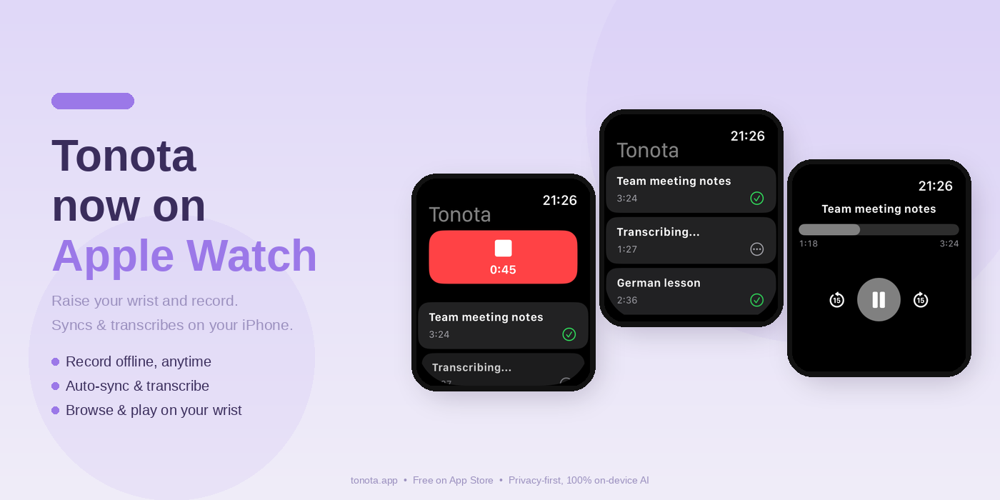

# Tonota

**Privacy-first voice memos for iPhone — transcribed and polished entirely on your device.**

Zero cloud. Zero account. Your voice never leaves your phone.

 

 

---

## Why Tonota?

Most voice memo apps upload your audio to a server for transcription. Tonota doesn't. Everything — recording, speech-to-text, and AI text polishing — runs locally on your iPhone using Apple Silicon.

- 🔒 **No cloud, no account, no tracking** — audio and transcripts stay in local storage, period
- ✈️ **Works fully offline** — transcribe on a plane, in the U-Bahn, anywhere
- 🧠 **On-device AI** — WhisperKit for transcription, local LLM for cleaning up your rambling into readable notes

## Features

- **Apple Watch companion app** — record directly from your wrist, offline; recordings sync to iPhone and transcribe automatically
- **On-device transcription** — powered by [WhisperKit](https://github.com/argmaxinc/WhisperKit), up to Whisper Large v3, 10 languages
- **AI text polishing** — a local LLM (via [MLX](https://github.com/ml-explore/mlx-swift)) turns raw speech into clean, readable text; pick your model with quality ratings
- **Live dictation mode** — optional real-time transcription while you speak
- **Record from anywhere** — Siri & Shortcuts actions ("Start Recording", "Stop & Save"), home-screen Quick Action, and a Control Center / Lock Screen button (iOS 18+)
- **Resumable transcriptions** — interrupted transcriptions are detected on next launch and resumed with one tap
- **Folders & search** — organize memos, search across titles and transcripts, batch-move memos between folders; folder tag shown in memo list
- **Batch export** — transcripts as `.txt`, original audio included
- **Localized** — English, Deutsch, 简体中文; switch language in-app without restarting (suggested by Nicky Xu)
- **Smarter model downloads** — pause, resume, or cancel mid-download; friendly error messages with a one-tap "Check network" button; no more phantom downloads when you leave the page (suggested by Kenny Wang)

## How it's built

Swift / SwiftUI · SwiftData (local-only, no CloudKit) · WhisperKit · mlx-swift-lm

> The story: from first line of code to App Store approval in **9 days** — written up [on LinkedIn](https://www.linkedin.com/feed/update/urn:li:activity:7470456182693056512/). v1.6 build notes [also on LinkedIn](https://www.linkedin.com/posts/janewush_ios-buildinpublic-ondeviceai-ugcPost-7471225779654254592-5pmQ/).

## Open-source acknowledgements

Tonota uses the following open-source libraries:

- [WhisperKit](https://github.com/argmaxinc/WhisperKit) — MIT License, Copyright (c) 2024 argmax, inc.
- [mlx-swift-lm](https://github.com/ml-explore/mlx-swift-lm) — MIT License, Copyright (c) 2024 ml-explore.

Full license notices are available on the [Open Source Licenses](https://janewu77.github.io/Tonota/open-source.html) page. Model files may have separate licenses from their upstream providers.

Model acknowledgements:

- Speech recognition models are downloaded from [argmaxinc/whisperkit-coreml](https://huggingface.co/argmaxinc/whisperkit-coreml), based on the OpenAI Whisper model family.
- Local LLM polishing models are not bundled with Tonota. They are downloaded from Hugging Face through `mlx-swift-lm` only when the user chooses to install one. The selectable Qwen2.5/Qwen3 MLX community conversions are listed as Apache 2.0; optional/custom models keep their own upstream model licenses.

## What's new in 1.7

Tonota comes to Apple Watch. Raise your wrist and record — no need to reach for your phone. Recordings sync to iPhone and transcribe automatically. Plus browse recent memos and play audio on the watch. Also new: switch the app language in-app (English / German / Chinese, no restart), folder tags in the memo list, live dictation no longer auto-closes, and model downloads support pause / resume / cancel with friendlier error handling.

## What's new in 1.6

Start recording without opening the app: Siri & Shortcuts actions (chain them into automations — e.g. record when your car's Bluetooth connects), a home-screen Quick Action, and a Control Center / Lock Screen button (iOS 18+). Plus resumable interrupted transcriptions, batch move to folders, and a new About page.

## Roadmap

- Streaming LLM output
- Import / export improvements
- Optional noise reduction

Found a bug or have a feature request? [Open an issue](../../issues) — feedback is very welcome.

## Privacy

Tonota collects nothing. See the [privacy policy](https://janewu77.github.io/Tonota/privacy.html).

---

Built in Hamburg 🇩🇪 by [Jane Wu](https://github.com/janewu77)

