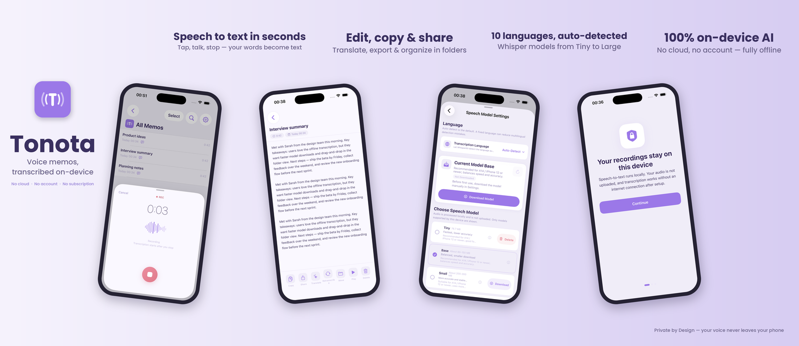
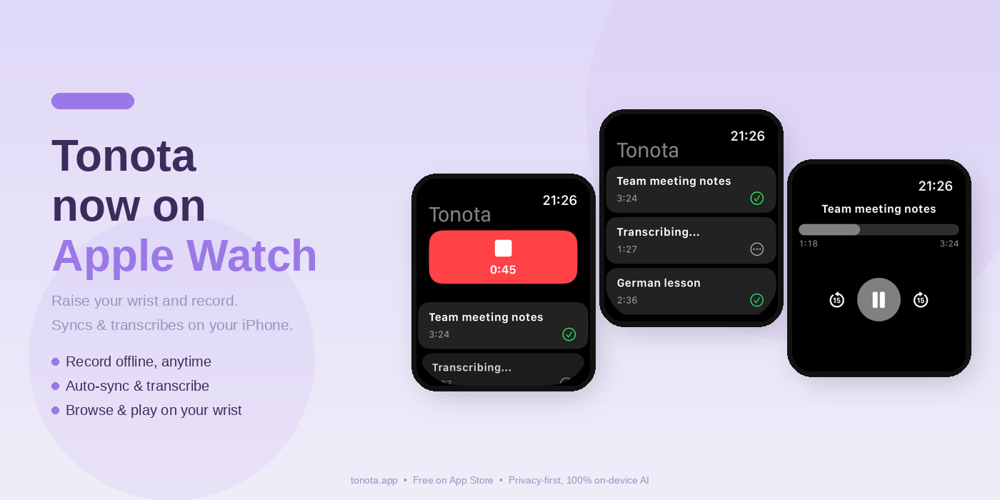

# Tonota

**Privacy-first voice memos for iPhone — transcribed and polished entirely on your device.**

On-device processing. No account. Export and share when you choose.

---

## Why Tonota?

Most voice memo apps upload your audio to a server for transcription. Tonota doesn't. Everything — recording, speech-to-text, and AI text polishing — runs locally on your iPhone using Apple Silicon.

- 🔒 **No cloud processing, no account, no tracking** — audio and transcripts are processed locally; you control exports and sharing
- ✈️ **Works offline after model setup** — download the required models first, then transcribe on a plane, in the U-Bahn, anywhere
- 🧠 **On-device AI** — WhisperKit for transcription, local LLM for cleaning up your rambling into readable notes

## Features

### Recording, transcription, and playback

- **One-tap voice memos** — record on iPhone and get an editable transcript after stopping. Copy text, share notes, and keep the original audio.
- **On-device speech recognition** — powered by [WhisperKit](https://github.com/argmaxinc/WhisperKit), with models up to Whisper Large v3. Supports 10 languages with automatic detection or a fixed language setting.
- **Live dictation** — see text while you speak. Switch between recording and live dictation for the current session without changing your default mode; the finished live transcript stays open until you dismiss it.
- **Segmented saving and continuation** — recorded and imported audio is processed section by section. Each completed section is saved and displayed immediately. Read, copy, and share saved text while processing continues; editing becomes available when transcription finishes. After an interruption, continue from a valid saved checkpoint. Older failed notes without one retry from the beginning.
- **Tap-to-seek playback** — place the cursor on a sentence and press play to hear that part of the recording, with the active text highlighted. Select, copy, and edit the transcript (suggested by Nicky Xu).
- **Quick recording access** — Siri and Shortcuts ("Start Recording" / "Stop & Save"), an app-icon Quick Action, and a Control Center / Lock Screen control (iOS 18+).

### Local AI Tools

- **Translate, summarize, extract action points, rewrite, and polish** — run built-in tools or create up to five custom tools with a name, icon, and instructions.
- **Choose your language model** — use downloadable models through [MLX](https://github.com/ml-explore/mlx-swift), or [Apple Foundation Models](https://developer.apple.com/apple-intelligence/) on supported devices with Apple Intelligence enabled and ready.
- **Streaming manual results** — see output as it is generated, with the actual model name displayed and reasoning collapsed by default.
- **Automatic follow-up** — opt in to run up to three tools when a completed transcript is nonempty and under 1,500 characters after trimming surrounding whitespace. Drag to set the order; each tool uses the same original transcript and appends its result. Requires an available local language model and never starts a model download automatically.
- **Result handling** — append AI output to your note. Appending clears that memo's sentence-playback timestamps; ordinary audio playback remains available. Unfinished automatic jobs do not restart after force-quitting, but saved results remain.

### Apple Watch

- Record locally on your watch for up to two hours, including with the screen off or your iPhone away; recordings transfer to the paired iPhone for transcription.
- Browse recent Watch recordings and play audio on your wrist.
- Request another transfer from iPhone for recordings still awaiting acknowledgement on Watch.

### Organization, export, and settings

- **Folders and search** — organize memos into folders, search titles and transcripts, and see folder tags in the memo list.
- **Batch actions** — select all or multiple memos to move or delete. Create a folder while moving memos.
- **Export and sharing** — export transcripts as `.txt` with original audio, use system sharing, or enable export to a folder you choose.
- **Model management** — guided setup, device-aware choices, and downloads you can pause, resume, or cancel. Friendly network errors and a connection check help troubleshoot downloads (suggested by Kenny Wang).
- **Interface languages** — English, German, and Simplified Chinese. Follow the system language or switch in-app without restarting (suggested by Nicky Xu).

## Requirements and setup

- iPhone 12 (A14) or later, running iOS 17 or later.
- The Control Center / Lock Screen control requires iOS 18 or later.
- The optional Watch app requires a paired Apple Watch running watchOS 10 or later.
- Apple's system language model requires iOS 26 or later and supported hardware with Apple Intelligence enabled and ready. Other local language models depend on device capability and available memory.
- Complete onboarding and download a speech model before transcription. Download a language model separately for AI Tools, or select the available Apple system model.
- Model downloads require internet access. Once the required models are ready, transcription and local AI processing work offline. Microphone permission is required for recording; exporting, sharing, and opening external links are user-controlled actions.

## How it's built

Swift / SwiftUI · SwiftData (local-only, no CloudKit) · AVFoundation · WhisperKit · mlx-swift-lm · Apple Foundation Models · WatchConnectivity

> The story: from first line of code to App Store approval in **9 days** — written up [on LinkedIn](https://www.linkedin.com/feed/update/urn:li:activity:7470456182693056512/). v1.6 build notes [also on LinkedIn](https://www.linkedin.com/posts/janewush_ios-buildinpublic-ondeviceai-ugcPost-7471225779654254592-5pmQ/), and v1.7 (Apple Watch) [on LinkedIn too](https://www.linkedin.com/posts/janewush_ios-buildinpublic-ondeviceai-activity-7475131511336525825-v-kX).

## Open-source acknowledgements

Tonota uses the following open-source libraries:

- [WhisperKit](https://github.com/argmaxinc/WhisperKit) — MIT License, Copyright (c) 2024 argmax, inc.
- [mlx-swift-lm](https://github.com/ml-explore/mlx-swift-lm) — MIT License, Copyright (c) 2024 ml-explore.

Full license notices are available on the [Open Source Licenses](https://janewu77.github.io/Tonota/open-source.html) page. Model files may have separate licenses from their upstream providers.

Model acknowledgements:

- Speech recognition models are downloaded from [argmaxinc/whisperkit-coreml](https://huggingface.co/argmaxinc/whisperkit-coreml), based on the OpenAI Whisper model family.
- Local LLM polishing models are not bundled with Tonota. They are downloaded from Hugging Face through `mlx-swift-lm` only when the user chooses to install one. The selectable Qwen2.5/Qwen3 MLX community conversions are listed as Apache 2.0; optional/custom models keep their own upstream model licenses.
- On supported devices, Tonota can also use [Apple Foundation Models](https://developer.apple.com/apple-intelligence/) (part of Apple Intelligence) as an optional on-device language model. It is a system framework provided by Apple, not bundled with Tonota, and its use is governed by Apple's software license and Apple Intelligence terms.

## What's new in 1.10

- **Saved transcription progress:** recorded and imported audio now saves text and a checkpoint after each successful segment. Interrupted jobs can continue from their last saved position instead of redoing the whole recording when a valid checkpoint exists.
- **Automatic AI Tools:** choose up to three tools for completed transcripts under 1,500 characters. Each uses the original text and appends its result; a local language model must already be available.
- **Tool management:** built-in and custom groups, Auto selection, drag-to-reorder controls, and first-line instruction previews.
- **Reliability and usability:** Watch recording retransfers, clearer transcription recovery prompts, recording startup cleanup, more space for live dictation text, and a privacy policy link in About.

## What's new in 1.9

Tap a line in a transcript to play from that exact moment — the sentence you're hearing highlights as it plays. The Apple Watch app now records up to 2 hours in a single session (up from 10 minutes), continuing in the background with the screen off. Long recordings (5+ minutes) transcribe in segments with a live progress percentage instead of just a spinner, and you can now switch between the recording screen and live dictation mid-session without going through Settings.

## What's new in 1.8

On-device AI gets a big upgrade. Translate a transcript or run built-in AI tools — summarize, extract key points, and more — entirely on your phone. Choose an MLX local model, or on supported devices use **Apple Foundation Models** (Apple Intelligence) with no download at all. Results stream in as they generate, the active model name is shown, and the model's reasoning stays collapsed by default. You can also create up to 5 of your own custom tools. Models that exceed your device's memory are hidden automatically.

## What's new in 1.7

Tonota comes to Apple Watch. Raise your wrist and record — no need to reach for your phone. Recordings sync to iPhone and transcribe automatically. Plus browse recent memos and play audio on the watch. Also new: switch the app language in-app (English / German / Chinese, no restart), folder tags in the memo list, live dictation no longer auto-closes, and model downloads support pause / resume / cancel with friendlier error handling.

## What's new in 1.6

Start recording without opening the app: Siri & Shortcuts actions (chain them into automations — e.g. record when your car's Bluetooth connects), a home-screen Quick Action, and a Control Center / Lock Screen button (iOS 18+). Plus resumable interrupted transcriptions, batch move to folders, and a new About page.

## Roadmap

- Import / export improvements
- Optional noise reduction

Found a bug or have a feature request? [Open an issue](../../issues) — feedback is very welcome.

## Privacy

Tonota collects nothing. See the [privacy policy](https://janewu77.github.io/Tonota/privacy.html).

---

Built in Hamburg 🇩🇪 by [Jane Wu](https://github.com/janewu77)